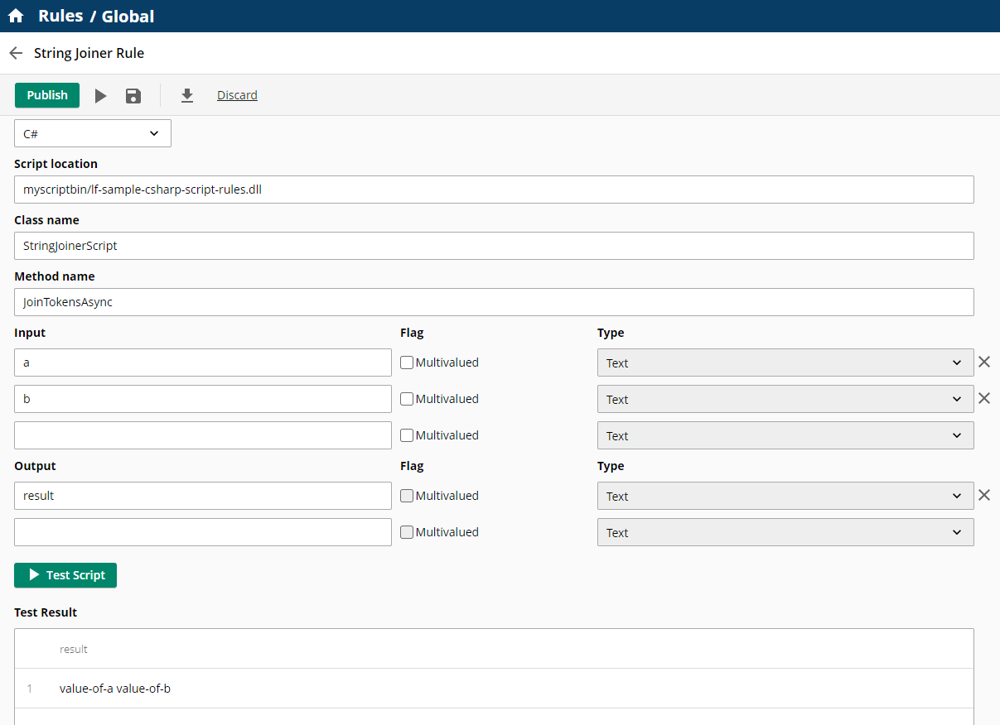
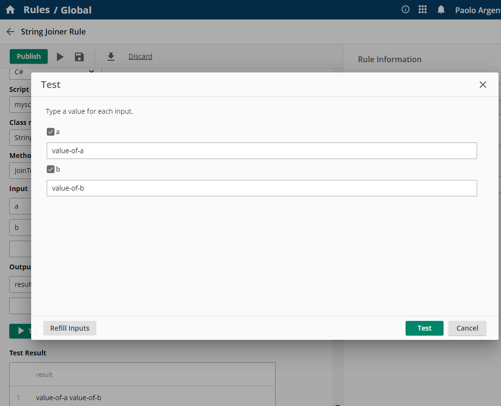

# String Join Laserfiche C# Rule script project

The script method invoked in this example is `StringJoinerScript.JoinTokensAsync()`

## Deploy script to your remote agent

- Copy the content of the build output folder `sample-rules\bin\Debug\netstandard2.0` folder under one of the three LFPALocalAgent folder e.g. `C:\Program Files\Laserfiche\ProcessAutomationWorkerAgent\LFPALocalAgent\myscriptbin`

## Configure and test this script rule in your Laserfiche Cloud Account -> Process Automation -> Rules

- Create a new Script rule
  - Script location: `myscriptbin/lf-sample-csharp-script-rules.dll`
  - Class name: `StringJoinerScript`
  - Method name: `JoinTokensAsync`
  - Output: `result` The *key* name in the outputs Dictionary

  

## Test the rule

- Providing test input values, for example: a and b:

## Test script rule in a workflow

- Run the workflow and verify `runscriptrule_result` token contains expected result

