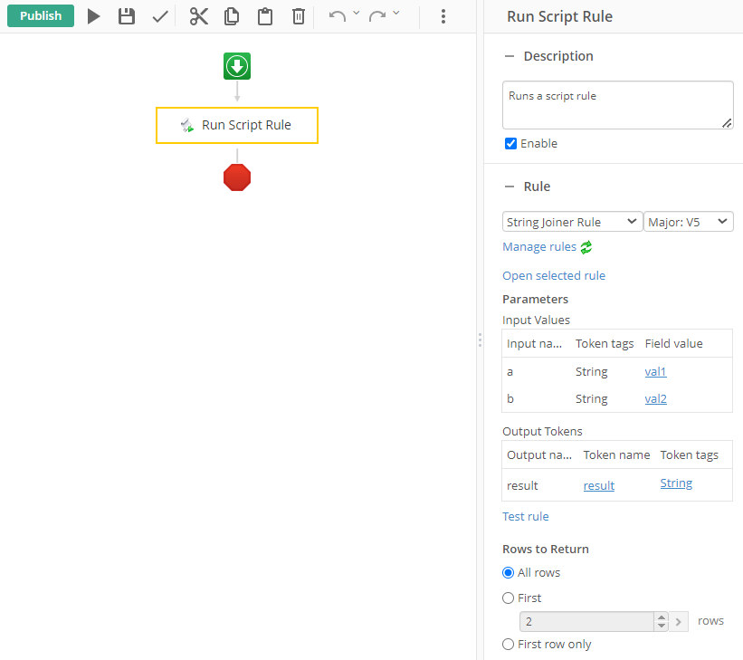

# Sample Laserfiche C# Rule script project

Sample C# script that can be invoked from Laserfiche workflow or business process.

Scripts are invoked by **Laserfiche Remote Agent** which is a service installed on a Windows PC for this purpose.

The script method invoked in this example is `StringJoinerScript.JoinTokensAsync()`

NOTE: .NET rule script must be Dlls targeting **netstandard2.0** or **net48**

## Prerequisite

- [.Net SDK 7.0](https://dotnet.microsoft.com/en-us/download)
- [Visual Studio Code v1.80 or later](https://code.visualstudio.com/download)
  - With `C# Dev Kit` VS Code extension
- [A Laserfiche Cloud Account](https://www.laserfiche.com/signon/)
- [Creating a C# Script Documentation](https://doc.laserfiche.com/laserfiche.documentation/en-us/Default.htm#../Subsystems/ProcessAutomation/Content/Resources/Rules/csharpscript.htm?TocPath=Process%2520Automation%257CRules%257CGetting%2520Started%2520With%2520Scripts%257C_____1)

## Build and Test script

- Clone this GIT repository
- Open a PowerShell terminal window:
  - To build project: `dotnet build`
  - To run tests: `dotnet test` (or use VSCODE Testing window UI which also support debugging individual test)

## Configure a remote agent

- [Remote Agents Documentation](https://doc.laserfiche.com/laserfiche.documentation/en-us/Default.htm#../Subsystems/ProcessAutomation/Content/Resources/Integrations/Remote-Agents/Remote-Agents.htm?TocPath=Process%2520Automation%257CIntegrations%257CRemote%2520Agents%257C_____0)

## Deploy script to your remote agent

- Copy the content of the build output folder `sample-rules\bin\Debug\netstandard2.0` folder under one of the three LFPALocalAgent folder e.g. `C:\Program Files\Laserfiche\ProcessAutomationWorkerAgent\LFPALocalAgent\myscriptbin`

## Configure and test this script rule in your Laserfiche Cloud Account -> Process Automation -> Rules

- Create a new Script rule
  - Script location: `myscriptbin/lf-sample-csharp-script-rules.dll`
  - Class name: `StringJoinerScript`
  - Method name: `JoinTokensAsync`
  - Output: `result` The *key* name in the outputs Dictionary

  

## Test the rule

- Providing test input values, for example: a and b:

## Test script rule in a workflow

- Run the workflow and verify `runscriptrule_result` token contains expected result

